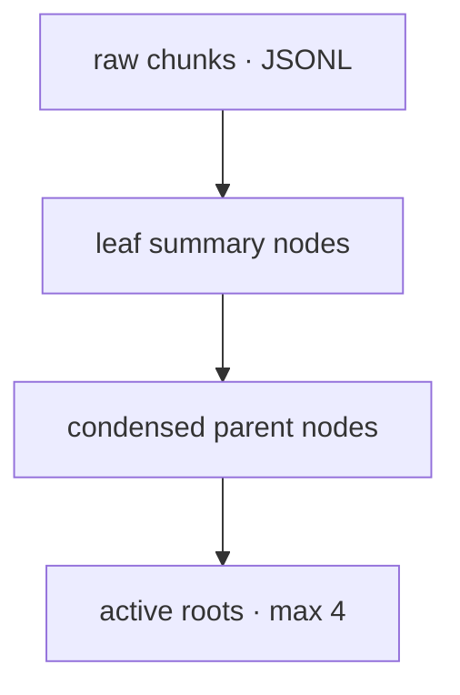

# omp-lcm-inspired-compaction

Artifact-backed hierarchical compaction for Oh My Pi (OMP). The plugin keeps exact discarded session entries in session-scoped artifacts, builds bounded immutable summary roots, and renders those roots through OMP context-full or public snapcompact APIs.

## What it is

OMP (Oh My Pi) is the coding-agent harness that this plugin extends. When a
conversation grows past its context window, OMP *compacts* it: it summarizes
the history so the model can keep going. The built-in compaction loses
information — exact prompts, tool outputs, and file contents get collapsed
into prose.

LCM (Lossless Context Management) is a design from the research paper
[arXiv:2605.04050](https://arxiv.org/abs/2605.04050): compaction doesn't have
to lose anything. Keep every discarded byte in an artifact store, build a
*hierarchical* set of summaries over it, and let the model dig back into the
raw history on demand. This plugin is a standalone OMP extension that
replaces OMP's built-in compaction with an LCM implementation. It hooks the
exact moment OMP is about to compact (`session_before_compact`), does its
work, and hands back a complete compaction result — with one hard
constraint: OMP gives the hook **30 seconds** total.

## The three pillars

**1. Raw preservation.** Everything the compaction would discard (messages,
tool calls/results, metadata) is serialized into JSONL *raw artifacts* — one
file per chunk of roughly 12k tokens — stored in the session's artifact
store. These are the ground truth; summaries are only ever an index over
them.

**2. Hierarchical summaries (the DAG).** Summaries form a tree:

- *Leaf nodes*: each batch of raw chunks becomes one model-written summary,
  and the leaf node records which raw artifacts it covers.
- *Condensed nodes*: when there are more than 4 roots (or they exceed the
  summary token budget), groups of roots are summarized into a parent node
  that records its children. Repeat until at most 4 *active roots* remain.
- Roots are the only thing carried forward in the next conversation's
  preserve data; everything below stays in the artifact store, reachable by
  id.



Compaction generations compose: each later compaction loads the previous
roots, adds new level-0 leaves, and condenses:

```text
generation 1:  leaf A ── raw A     leaf B ── raw B

generation 2:  parent C
                ├── leaf A ── raw A
                └── leaf B ── raw B
              leaf D ── raw D

generation 3:  parent E
                ├── parent C
                └── leaf D
```

The model sees roots rendered as `### Root 1 / <summary> / Expand node:
artifact://<id>`, so it can expand any branch with a retrieval tool. The
summaries are intentionally lossy views for context efficiency; the archival
graph is lossless because the original discarded entries are preserved
verbatim.

**3. Provider-native replay.** For OpenAI-Codex models, the plugin *also*
runs OMP's own remote compaction alongside the local summaries and persists
the provider's encrypted *replacement history* into the session. On the next
request, the provider reconstructs the prior conversation natively — the
model continues with the real previous turns, not just a summary. This is
gated by a *lineage* check (provider, model, endpoint, and credential
identity must all match) so one model's encrypted history is never fed to a
different model. If replay fails, the textual LCM result still stands —
replay is a bonus, not a dependency.

## What happens during compaction (the 30-second window)

1. **Capture** — select the discarded source entries and chunk them into raw
   JSONL in memory. No artifacts are written yet; writes are deferred to the
   DAG phase so a mid-run abort leaves zero artifacts.
2. **Orphan accounting** — count artifact files not referenced by any
   installed node or root and report them in status
   (`lastOrphanArtifactCount`). Detection only: OMP exposes no delete API, so
   garbage collection is impossible from the extension boundary.
3. **Tier resolution** — pick a model tier for leaf summaries
   (`leafSummaryModel`/`rootSummaryModel`: `tiny`, `smol`, or `active`),
   checking each candidate's context window fits the batches.
4. **Batched leaf summaries** — raw chunks are consolidated into
   model-aware batches (default 48k estimated tokens), run through a bounded
   pool (default 4 concurrent calls) under a hard internal deadline.
5. **Root condensation** — resolve the root model, then condense/repair the
   DAG to at most 4 roots, writing each raw artifact immediately before its
   leaf node (abort-safe: a signal check between every write).
6. **Native replay** — the OpenAI v1/v2 remote compaction, deadline-gated
   and lineage-gated.
7. **Render** — produce the final OMP result: `context-full` (complete
   replacement context) or `snapcompact` (vision-model frame summaries),
   degrading snapcompact to context-full only under deadline pressure.
8. **Status** — persist diagnostics as a session entry so `/lcm status`,
   `/lcm dump`, and `/lcm version` keep reporting the last run across
   reloads.

**Deadlines** are why this fits in 30 seconds: an internal budget
(`handlerDeadlineMs`, default 24s) is split across the leaf stage, root
stage, native replay, and a render reserve, and every stage checks its
remaining time. If the budget runs out, batches degrade to a *deterministic
fallback* — a bounded, byte-exact excerpt marked `[deterministic fallback]`
— instead of failing the compaction or fabricating content.

**Auth** goes through OMP's own credential machinery: 401 forces an OAuth
bearer refresh, 403/usage-limit rotates credentials. Without this, a stale
token would silently degrade every summary to the fallback.

**Fail-closed** is the operating principle: any unexpected error returns
`{ cancel: true }` (OMP skips the LCM result) — never a silently wrong
compaction, never a fall-through to built-in behavior without notice.

## Data contracts

- `lcm-raw` — JSONL chunk artifact.
- `lcm-node` — summary node artifact: schema `omp-lcm-node/v1`, kind
  (`leaf-summary`/`condensed-summary`/`legacy-summary`), children ids,
  `rawSources` ids, source entry ids/counts.
- Preserve state `ompLcmArtifactsV1` — `{ version, generation, roots }`;
  generation increments each compaction, roots carry artifact ids.
- Artifact ids are numeric strings, session-scoped (a documented limitation:
  not globally unique).

## Retrieval tools

The model's way back into history: `lcm_expand` walks a node's subtree with
optional raw previews, `lcm_describe` reads metadata without expanding
content (plus type-aware exploration of OMP-spilled tool results), and
`lcm_grep` regex-searches the raw history reachable from the roots. Exact
source is also reachable directly through OMP's own `read` and `grep` against
`artifact://` URIs. See [Retrieval](#retrieval) for full usage, bounds, and
id semantics.

## Reliability hardening

- Every summary call runs through the registry's auth-retry resolver:
  401 force-refresh, 403/usage-limit rotation, failures recorded in status
  instead of swallowed.
- The session id is forwarded to the native replay request; replay failures
  surface as a bounded notification while the textual LCM result still
  completes.
- Diagnostics persist across extension reloads (`lcm-status` session entry).
- Raw artifacts are written only immediately before their leaf node, so an
  abort before the first node write leaves **zero** new artifacts
  (regression-tested).
- `bun run canary` automates the release gate: pack the plugin, install the
  packed directory into a clean temporary OMP profile, verify the install,
  then run the opt-in live integration against configured credentials —
  non-zero exit on any failure.

## Current state

- Test evidence (unit suite counts, live integration results against real
  OpenAI-Codex credentials, typecheck status) is kept in `VERIFICATION.md`;
  run `bun test` and `bun run test:integration` to reproduce it.
- Every P0/P1 gap is closed or explicitly accepted with a written
  disposition. Documented non-goals: no async soft-threshold compaction, no
  artifact transactions or orphan GC (blocked on public OMP APIs), raw
  artifacts are plaintext at rest, and the deterministic fallback preserves
  bytes rather than semantics.
- Release note: the marketplace resolves from git tags; `v0.2.3` is the
  latest published release (Part II deadline-safe tiers, Part IV reliability
  hardening, and Part V orphan-window hardening + release canary).

## Install and enable

For automatic marketplace updates, add this repository as a marketplace and
install the named plugin into the user scope:

```sh
omp plugin marketplace add https://github.com/nszceta/omp-lcm-inspired-compaction
omp plugin install omp-lcm-inspired-compaction@nszceta-lcm --scope user
```

The marketplace manifest is `.omp-plugin/marketplace.json`. The `nszceta-lcm`
marketplace name keeps this plugin separate from other `nszceta` marketplaces;
verify it with:

```sh
omp plugin marketplace list
omp plugin list
```

To receive new tagged releases, refresh the marketplace metadata and upgrade
the installed plugin:

```sh
omp plugin marketplace update nszceta-lcm
omp plugin upgrade omp-lcm-inspired-compaction@nszceta-lcm --scope user
```

To upgrade every marketplace plugin instead:

```sh
omp plugin marketplace update
omp plugin upgrade
```

`omp plugin install ./path/to/this/repository` is useful for local development
but creates a local link and does not track marketplace releases. Likewise,
installing a raw GitHub URL is a direct install; use the marketplace commands
above for update tracking. Restart OMP, or reload extensions, after installing
or upgrading.

The package supports OMP 17.2.3+ and uses only published OMP extension APIs.
Credential resolution for leaf/root summary calls goes through the registry's
own auth-retry resolver (`ModelRegistry.resolver`) wrapped by pi-ai's
`withAuth`, so stale OAuth bearers (Codex, Gemini CLI, Anthropic, xAI) are
force-refreshed and rotated instead of degrading summaries to the
deterministic fallback. Registries that only expose `getApiKey` are wrapped
with a refresh-aware resolver; the tier snapshot seeds the first attempt, and
the tier availability gate resolves through the same resolver when one
exists (the keyless-provider sentinel is never treated as a usable key).
`/lcm status` and `/lcm dump` survive extension reloads: each run persists a
bounded diagnostics snapshot as a session entry that registration restores.

The `renderer` setting accepts `auto`, `context-full`, or `snapcompact`.
`auto` selects snapcompact only for a snapcompact preparation with a
vision-capable model and no custom instructions; otherwise it uses context-full.
Set an explicit renderer when deterministic behavior is required. Automatic
LCM is intended for OMP `context-full` and `snapcompact`; handoff, shake, and
off remain OMP-controlled.

## Commands

- `/lcm` or `/lcm help` displays command help in the OMP UI.
- `/lcm version` shows the plugin version currently loaded by OMP.
- `/lcm status` shows the last renderer, generation, roots, summary quality,
  provider-native replay status, bounded result metadata, and outcome/error
  status.
- `/lcm dump` prints those diagnostics and traverses the bounded artifact DAG
  with structural, single-line summary previews.
- Tab completion after `/lcm ` suggests `help`, `status`, `dump`, `version`,
  and `renderer`; after `/lcm renderer ` it suggests all supported renderers.
- `/lcm renderer auto`
- `/lcm renderer context-full`
- `/lcm renderer snapcompact`

## Retrieval

Each discarded source chunk is stored as exact JSONL in an `lcm-raw` session artifact. Immutable `lcm-node` artifacts contain leaf or parent summaries and their provenance. Active context contains only bounded root summaries and deterministic links:

```text
Expand node: artifact://17
```
Use the registered `lcm_expand` tool for node structure and optional raw previews. Use `read artifact://17` or a selector such as `read artifact://17:1-300` for exact source, and `grep "symbol" artifact://17` for exact search. Root artifact IDs are shown by `/lcm dump`; IDs are numeric and scoped to the OMP session, so never predict an ID.

The plugin registers two additional retrieval tools:

- `lcm_describe` — metadata lookup without expansion. Given an artifact ID it
  reports node kind/level/children/raw sources/source-entry count/token
  estimate and the full summary text for `lcm-node` artifacts, entry/byte
  statistics with a bounded preview for `lcm-raw` artifacts, and metadata for
  any other artifact. With `explore: true` on a non-LCM artifact (an
  OMP-spilled tool result), it produces a bounded, type-aware exploration
  summary: JSON gets key/type/count extraction, CSV gets columns and row
  statistics, SQL gets statement kinds and table names, code gets function and
  class signatures, and unstructured text gets one model summary call using
  the active model and key (degrading to a bounded head/tail preview on model
  failure or abort). Metadata-only mode never calls a model.
- `lcm_grep` — regex search over the full immutable history reachable from the
  current roots (or from one `summaryId` subtree), grouped by the covering
  summary node and paginated via `limit` (default 50, max 200). Roots are
  discovered from the persisted branch, so it works after a reload. Per-artifact
  scans are capped at 256 KiB and report `(partial scan)` when truncated;
  missing artifacts are reported, never silently dropped.

Oversized tool results are already stored in full by OMP itself: any result
above the artifact-spill threshold is saved through the same session artifact
store the plugin uses (`tools.artifactSpillThreshold`, default 50 KiB), with a
bounded elided view plus a `[raw output: artifact://N]` footer left in the
transcript. The plugin relies on that mechanism for large-file handling and
adds no capture-time file pipeline: `lcm-raw` entries retain
`details.meta.truncation.artifactId`, so the exact full text of any spilled
result remains reachable through `read artifact://N` in this session's store.

## Rendering and remote behavior

Context-full returns a complete custom compaction result containing portable
text roots and LCM preserve state. Snapcompact receives a synthetic message
containing current roots, never the previous raw transcript/archive, and
preserves the summary-only archive across context rebuilds. A second compaction
creates parent nodes while retaining the original raw artifacts transitively.

Returning a complete result from `session_before_compact` bypasses OMP's
built-in compaction call. For eligible OpenAI Responses models with remote
compaction enabled, the plugin delegates replay generation to OMP's published
compaction orchestrator. OMP uses streaming V2 when the active model advertises
it and the setting permits it, including retained-message budgeting and the
session's active thinking effort; otherwise OMP uses its eligible V1 path. The
plugin merges the resulting `openaiRemoteCompaction` state with
`ompLcmArtifactsV1`.

A later compaction seeds a fresh remote request only when the preserved replay
lineage matches the active provider, effective model ID, Responses API variant
and V1/V2 mechanism, normalized endpoint, and non-secret credential
fingerprint. OAuth lineage uses stable account/organization/credential
metadata, so access-token refresh does not break continuity. Legacy or
mismatched lineage, disabled/ineligible models, missing credentials, empty
input, and remote failure never install stale replay data; textual LCM
continuity remains usable while a fresh native lineage starts.

Exact raw artifacts retain opaque `thinkingSignature`, `encrypted_content`, and
provider payload fields. The summary projection omits those opaque values so
they consume no summarization tokens. `/lcm status` and `/lcm dump` report
native replay status, provider, item count, whether prior history was seeded,
and a bounded error. Diagnostics call the bypass
`builtInRemoteContextFullIntercepted`; it describes interception of OMP's
built-in branch, not whether the plugin's explicit native replay request ran.

If a model summary fails, the plugin converges to a deterministic bounded
archival summary. If the event is aborted, the boundary is invalid, an artifact
write fails, the model/key required for textual summarization is missing, or an
explicit snapcompact renderer lacks image support, the plugin notifies and
returns `{ cancel: true }`; it never falls through to built-in compaction.

## Summarization model tiers and deadlines

Source summarization runs through configurable model tiers resolved from the
active extension context. The new `omp` settings (bounds enforced by clamping;
invalid values fall back to defaults):

| Setting | Values | Default | Meaning |
|---|---|---|---|
| `leafSummaryModel` | `tiny` \| `smol` \| `active` | `tiny` | Tier for leaf/source-batch summaries; the online TINY role is preferred |
| `rootSummaryModel` | `tiny` \| `smol` \| `active` | `smol` | Tier for root condensation and repair |
| `summaryConcurrency` | 1–8 | 4 | Maximum concurrent summary model calls |
| `summaryBatchInputTokens` | 12000–96000 | 48000 | Maximum estimated tokens per consolidated summary batch |
| `handlerDeadlineMs` | 10000–27000 | 24000 | Internal compaction deadline |

`handlerDeadlineMs` stays below OMP's fixed 30-second extension-handler
timeout; increasing OMP's timeout is neither required nor supported.

Leaf/source-batch summaries prefer the online TINY role, resolved through the
public extension model query facade (`ctx.models.resolve("@tiny")`); root
condensation and repair prefer SMOL and fall back to the active model.
Resolution order is leaf: `tiny` → `smol` → `active` → deterministic, and
root: `smol` → `active` → `tiny` → deterministic. Fallback chains keep
working with no TINY role configured. OMP's local title models are never used
for source summarization: their input preprocessing would discard most of a
12K-token chunk.

Adjacent raw chunks are packed into model-aware summary batches (default 48K
estimated tokens, reduced when the resolved model's context window requires a
reserve), run through a bounded pool (default concurrency 4) with
order-preserving results; a leaf node may reference multiple raw artifacts.

The internal total deadline (default 24s) splits into a leaf stage (~58%), a
root stage, and a replay/render reserve; individual model calls time out at 9s.
Expired model work degrades to deterministic archival summaries, never to OMP
built-in compaction, and user cancellation still cancels. When the deadline
reserve is reached, native replay is skipped and snapcompact rendering may
degrade to context-full roots; status records the reason.

In addition to the existing fields, `/lcm status` now reports:

- `lastStartedAt`, `lastElapsedMs` — when the last compaction ran and how long it took
- `lastLeafSummaryModel`, `lastRootSummaryModel` — the concrete provider/model that summarized
- `lastRawChunkCount`, `lastSummaryBatchCount`, `lastSummaryConcurrency` — input size and batching
- `lastCompletedModelSummaryCount` — batches summarized by a model rather than the deterministic fallback
- `lastDeadlineFallbackCount`, `lastDeadlineStage` — deadline pressure and the stage that first fell back

## Live provider replay verification

Run the opt-in live integration suite against configured OpenAI-Codex
credentials with:

```text
bun run test:integration
```

The suite fixes both requested models at low effort. Its first test compacts
with `gpt-5.3-codex-spark`, switches to `gpt-5.6-luna`, and proves both use
OMP's streaming V2 mechanism while the Spark encrypted lineage is not seeded
into Luna and textual LCM advances to generation 2. Its second test performs
two Spark compactions and requires encrypted replacement history on both
rounds, LCM generations 1 then 2, and `lastNativeReplaySeeded: true` on the
compatible second round. Provider responses and remote compaction are live;
assertions use persisted structural state rather than generated prose.

On 2026-07-28, package `0.1.6` running on OMP `17.1.8` completed a live
end-to-end canary with the connected
`openai-codex/gpt-5.3-codex-spark` provider. No transport or provider response
was mocked.

**Conclusion:** encrypted provider-native remote compaction is successfully
integrated with LCM for the tested OpenAI-Codex path. The integration does more
than store encrypted fields: one compaction persisted the provider replacement
history alongside the textual LCM DAG, a new OMP process reconstructed that
history, and the provider accepted a real continuation request.

The pre-compaction conversation contained model reasoning plus real `read`,
`bash`, and `grep` tool calls. Its early canary values were nonce
`cedar-orbit-7319`, codename `Silver Heron`, batch size `17`, and the derived
result `323`. Two large tool-result turns then raised context use to 58.5%, and
manual compaction reduced it to 15.3%.

The live process reported:

```json
{
  "lastGeneration": 1,
  "lastNativeReplayStatus": "preserved",
  "lastNativeReplayProvider": "openai-codex",
  "lastNativeReplayItemCount": 6,
  "lastNativeReplaySeeded": false,
  "lastOutcome": "success"
}
```

The persisted compaction entry at `2026-07-28T19:24:45.511Z` contained both
`ompLcmArtifactsV1` and `openaiRemoteCompaction`. The latter identified
`openai-codex` and held six replacement-history items. This establishes that a
real remote-compaction response, rather than only the textual LCM result, was
installed in the saved session.

The first OMP process was then exited. A new process resumed the saved session
by ID, forcing OMP to rebuild context from the persisted compaction entry. The
next prompt prohibited tools and file reads and requested the values available
before compaction. The real provider continuation completed with
`stopReason: "stop"`, used zero tool calls, and returned:

```text
CANARY_REPLAY_ACCEPTED cedar-orbit-7319 Silver Heron 17 323
```

These observations prove the required chain for the connected provider: the
live compaction endpoint returned provider-native state, OMP persisted and
reloaded that state in a new process, the provider accepted the reconstructed
continuation request, and semantic continuity survived compaction. Textual LCM
roots remain in the same request as the provider-native state, so this canary
does not claim that native replay was the exclusive source of the recalled
words.

The canary scope is specifically the existing authenticated OpenAI-Codex
connection. A direct API-key-authenticated `openai` provider was not configured
or exercised, so this evidence must not be generalized to that credential and
endpoint path.

## Release canary

The automated release gate runs in one command:

```text
bun run canary
```

The canary packs the plugin, extracts the tarball, installs the packed
directory into a clean temporary OMP profile (fresh `OMP_PROFILE`; the
profile and temp state are removed on the way out), verifies the install with
`omp plugin list`, then runs the opt-in live integration
(`LCM_LIVE_INTEGRATION=1`) against configured OpenAI-Codex credentials. Any
step failure exits non-zero, so a broken pack, install, or live replay fails
the release. The install step validates the packed artifact end to end
(content, manifest, registration) in a fresh profile; the live step runs the
repo's integration suite, which builds an in-memory session from `src/` and
therefore runs with the operator's real environment (credentials from the
default profile) rather than the isolated canary profile.

Requirements: the `omp` CLI on PATH, configured OpenAI-Codex credentials in
the environment, and network access. The manual live loop documented above is
the exception, not the rule; the canary is the gate.

## Limitations

The standalone extension cannot provide asynchronous soft-threshold compaction, atomic multi-artifact transactions, globally unique IDs across sessions, automatic pre-handoff injection, or shake-region callbacks. Partial artifact writes may orphan artifacts, but no node or preserve state is installed unless all referenced writes succeed.
